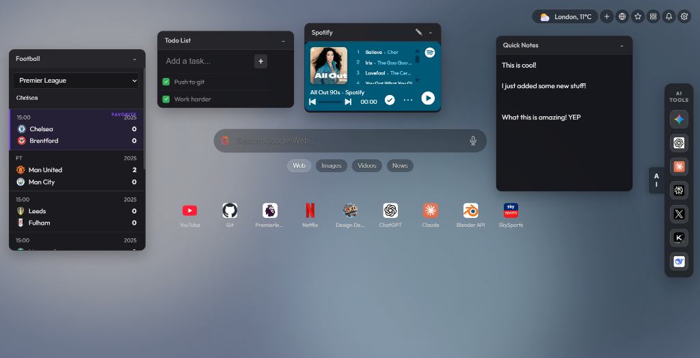
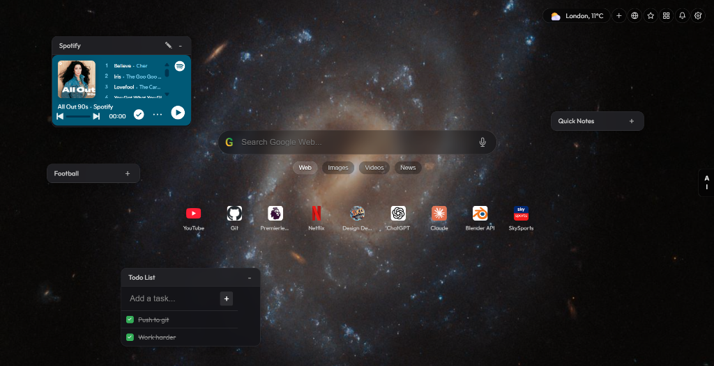

# Chrome Home 🏠✨

**Chrome Home** is a premium, high-performance New Tab extension designed to transform your browser into a stunning, productive workspace. Built with a focus on aesthetics, speed, and utility, it combines modern design principles with the essential tools you need daily.

---

## 📸 Screenshots
| Widgets & Productivity | Image Background Mode |
|---|---|
|  |  |

---

## 🌟 Visual Excellence
*   **Glassmorphism Design:** A sleek, semi-transparent UI that feels light and modern.
*   **Interactive Cursor Trail:** A smooth, responsive "mouse tail" effect that follows your cursor.
*   **Dynamic Backgrounds:** Choose between:
    *   **Weather-Driven:** The background changes colors and adds effects (Rain, Snow, Clouds) based on your real-time local weather.
    *   **Unsplash Integration:** High-quality photography that rotates on a customizable timer.
    *   **Interactive WebGL Gradients:** Smooth, pulsing patterns with a high-performance interactive shader. Includes tools to view color swatches and export palettes to JSON, CSV, or CSS.
*   **Premium Typography:** Utilizing *Outfit* and *Inter* fonts for a professional look.

## 🛠️ Productivity Suite
*   **Smart Shortcuts Grid:** Manage your most-visited sites with a beautiful, hover-animated icon grid. Supports **Drag-and-Drop Reordering** for a fully custom layout.
*   **Self-Managed "My Sites":** A dedicated panel for your favorite links with integrated reordering support.
*   **Integrated AI Sidebar:** Instant access to your favorite AI tools like Gemini, ChatGPT, Claude, and Perplexity without leaving your tab.
*   **Customizable Widgets:**
    *   🎵 **Spotify Player:** Control your music directly from the home page.
    *   🏀 **Live Sports Scores:** Track matches for **Football (Soccer)**, **American Football (NFL/NCAAF)**, and **Basketball (NBA/NCAAB)**.
    *   📰 **Tech News Feed:** Stay updated with the latest from Hacker News, Product Hunt, and DEV.to.
    *   📝 **Quick Notes & Todo:** Capture ideas and manage tasks with local persistence.

## ⚙️ Advanced Features
*   **Multi-Engine Search:** Toggle instantly between Google, DuckDuckGo, Bing, Brave, and Ecosia.
*   **Chrome Sync Support:** Your shortcuts and settings follow you to any computer where you're logged into Chrome.
*   **Notification Center:** A unified place for extension updates and system alerts.
*   **Data Portability:** Export your entire configuration to a JSON file or import a backup in seconds.

## 🔒 Privacy First
*   **Local Processing:** Your browsing history and "Top Sites" are processed entirely on your machine. We never see your data.
*   **Minimal Permissions:** We only ask for what is necessary to make the features work (e.g., Geolocation for weather).
*   **No Remotely Hosted Code:** Compliant with the latest Chrome Web Store security standards (Manifest V3).

---

## 🚀 Installation (Developer Mode)
1. Clone this repository: `git clone https://github.com/skdsam/chrome-home.git`
2. Open Chrome and navigate to `chrome://extensions/`
3. Enable **Developer Mode** (top right).
4. Click **Load unpacked** and select this project folder.

---
*Created with ❤️ for a better browsing experience.*
