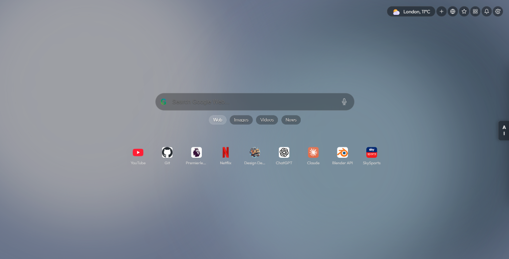
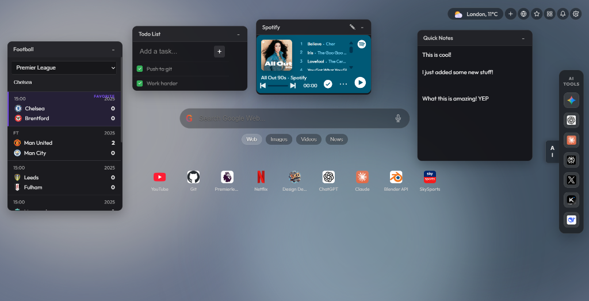
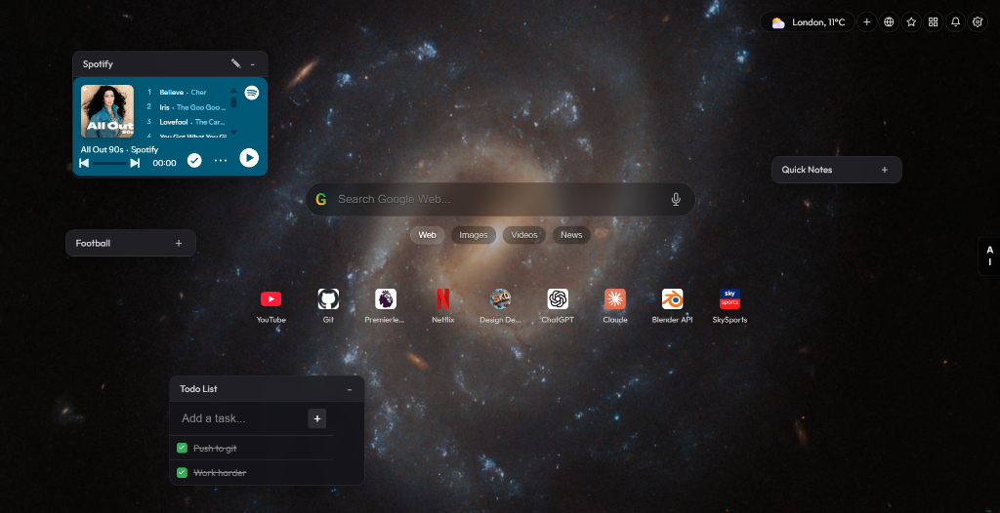

# Chrome Home 🏠✨

**Chrome Home** is a premium, high-performance New Tab extension designed to transform your browser into a stunning, productive workspace. Built with a focus on aesthetics, speed, and utility, it combines modern design principles with the essential tools you need daily.

---

## 📸 Screenshots
| Widgets & Productivity | Image Background Mode |
|---|---|
|  |  |

---

## 🌟 Visual Excellence
*   **Glassmorphism Design:** A sleek, semi-transparent UI that feels light and modern.
*   **Interactive Cursor Trail:** A smooth, responsive "mouse tail" effect that follows your cursor.
*   **Dynamic Backgrounds:** Choose between:
    *   **Weather-Driven:** The background changes colors and adds effects (Rain, Snow, Clouds) based on your real-time local weather.
    *   **Unsplash Integration:** High-quality photography that rotates on a customizable timer.
    *   **Interactive WebGL Gradients:** Smooth, pulsing patterns with a high-performance interactive shader. Includes tools to view color swatches and export palettes to JSON, CSV, or CSS.
*   **Premium Typography:** Utilizing *Outfit* and *Inter* fonts for a professional look.

## 🛠️ Productivity Suite
*   **Smart Shortcuts Grid:** Manage your most-visited sites with a beautiful, hover-animated icon grid. Supports **Drag-and-Drop Reordering** for a fully custom layout.
*   **Self-Managed "My Sites":** A dedicated panel for your favorite links with integrated reordering support.
*   **Integrated AI Sidebar:** Instant access to your favorite AI tools like Gemini, ChatGPT, Claude, and Perplexity without leaving your tab.
*   **Customizable Widgets:**
    *   🎵 **Spotify Player:** Control your music directly from the home page.
    *   🏀 **Live Sports Scores:** Track matches for **Football (Soccer)**, **American Football (NFL/NCAAF)**, and **Basketball (NBA/NCAAB)**.
    *   📰 **Tech News Feed:** Stay updated with the latest from Hacker News, Product Hunt, and DEV.to.
    *   📝 **Quick Notes & Todo:** Capture ideas and manage tasks with local persistence.

## ⚙️ Advanced Features
*   **Multi-Engine Search:** Toggle instantly between Google, DuckDuckGo, Bing, Brave, and Ecosia.
*   **Pip, the 3D Browser Companion:** A draggable, rocket-powered character that roams between page elements, sits on widgets, juggles, dances, scans shortcuts, retrieves off-screen objects, reacts to weather, and occasionally shares cached quotes, safe jokes, headlines, or sports updates.
*   **Chrome Sync Support:** Your shortcuts and settings follow you to any computer where you're logged into Chrome.
*   **Notification Center:** A unified place for extension updates and system alerts.
*   **Data Portability:** Export your entire configuration to a JSON file or import a backup in seconds.

## 🔒 Privacy First
*   **Local Processing:** Your browsing history and "Top Sites" are processed entirely on your machine. We never see your data.
*   **Minimal Permissions:** We only ask for what is necessary to make the features work (e.g., Geolocation for weather).
*   **No Remotely Hosted Code:** Compliant with the latest Chrome Web Store security standards (Manifest V3).

---

## 🚀 Installation (Developer Mode)
1. Clone this repository: `git clone https://github.com/skdsam/chrome-home.git`
2. Open Chrome and navigate to `chrome://extensions/`
3. Enable **Developer Mode** (top right).
4. Click **Load unpacked** and select this project folder.

---
*Created with ❤️ for a better browsing experience.*

### Spotify search

Start `start-spotify.bat` (or `npm run spotify`), then open the Spotify widget and connect your account. A Client ID alone requires Spotify login; a Client ID and Secret can search the public catalogue without user login. The helper keeps login tokens in memory. After restarting it, reconnect if you use a Client ID alone.

Search by name or paste a full `https://open.spotify.com/...` link or `spotify:...` URI. Use the result-type selector to narrow searches to artists, songs, albums or playlists. Pip uses the same search: for example, `play Beach House`, `play Queen playlist`, `play Hello by Adele`, or `play my playlist Summer`. Artist names and playlist intent are preserved.

Exact, unambiguous artist/song/album matches load the player. Ambiguous matches and playlists show choices with their creator and available artwork. Genre searches offer live playlist suggestions. Failed searches keep the current music and display the reason; they never substitute a default playlist. Full links and favourites bypass name matching. **Save favourite** remembers the selected Spotify ID (up to 20 favourites), and **Show other matches** lets you choose another result. Loading a selection does not start playback: press play in the Spotify embed.

**My playlists** searches all pages of the signed-in user's owned/followed playlists. Existing users should reconnect to grant playlist access. Public searches default to the GB market; set `SPOTIFY_MARKET` to another two-letter country code before starting the helper if needed. Spotify's account country takes precedence for user tokens. [Spotify Search API](https://developer.spotify.com/documentation/web-api/reference/search).

Run the matching, request-ordering, auth and helper regression tests with `node --test tests/spotify.test.js tests/spotify-server.test.js`. Live searches additionally require a configured helper and Spotify access.

### Ask Pip with local AI

Pip can save items directly, with or without Local AI enabled:

- `add buy milk` or `add buy milk to my todo list`
- `add quick note Meeting at 3pm` or `add Meeting at 3pm to quick notes`
- `add shortcut GitHub https://github.com`
- `add Example https://example.com to my sites`

Tasks and notes open their widgets; notes append to the active note. Website commands accept full HTTP(S) URLs or domains and avoid duplicate URLs within each collection. If you give a site name without its URL, Pip asks for the address and accepts it in your next message. Additions are saved before Pip confirms success, and remain available after reloading.

Click Pip and enable **Local AI ? Gemini Nano**, then submit a question. Chrome checks device support and may download its on-device model on the first request; progress appears in Ask Pip. No API key or separate model server is needed. If unavailable, bookmark search and basic planning remain usable.

Pip sends questions and the current daily focus to Chrome's local Prompt API. Bookmark searches run directly against Chrome bookmarks. AI output is text only and cannot execute actions. Up to three recent AI exchanges are kept in memory for follow-up questions and cleared when the dialog closes or Local AI changes. Model sessions are released after replies; Stop, closing the dialog, or leaving the page cancels active work. The local AI preference is saved on this device.

Requirements and model availability are managed by Chrome: https://developer.chrome.com/docs/ai/get-started . Unsupported browsers and devices do not download a model through Pip. To verify on a supported Chrome installation, open Ask Pip, enable Local AI, submit a question, check download/thinking status and a local reply, then test Stop and closing during a request.

Pip sits beside the non-modal Ask Pip card (above it on narrow screens). Gemini Nano can select a wave, nod, dance or curious pose; thinking has its own animation. When Local AI and occasional comments are enabled, Pip can generate a short comment roughly every 4?7 minutes while idle, using daily focus as context. Autonomous comments only use an already available model and never initiate a download. They pause while chatting or the page is hidden. Turn comments off in Ask Pip.

The top-right Pip button waves goodbye and sends Pip offscreen before saving the disabled preference. Click again to bring him back. Reduced motion uses a short stationary goodbye instead of flight.
